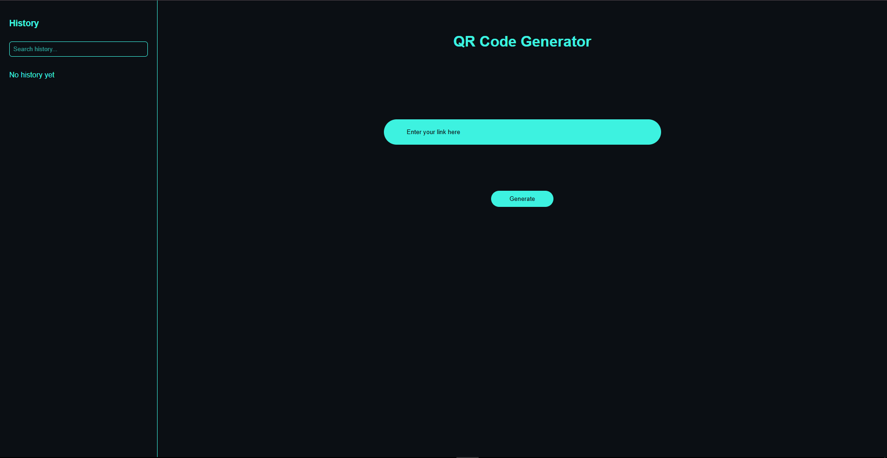
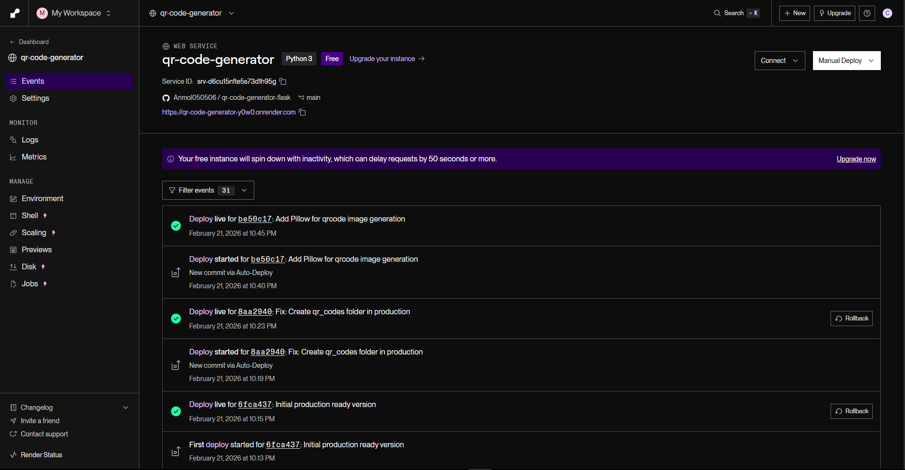

# QR Code Generator Web App

A full-stack QR Code Generator built using Flask and PostgreSQL.

## Features

- Generate QR codes from URLs
- Automatically fetch website title
- Favicon display for each link
- Searchable history sidebar
- Modal QR preview
- Download QR image
- Copy link to clipboard
- Delete confirmation modal
- PostgreSQL database integration

## Tech Stack

- Python (Flask)
- PostgreSQL
- HTML / CSS
- JavaScript
- Gunicorn (Production Server)

## How It Works

1. User enters a URL
2. QR code is generated and saved
3. Website title is scraped
4. Data stored in PostgreSQL
5. History displayed in sidebar

## Deployment

Deployed using Render with PostgreSQL database.

## 📸 Screenshots

### Home Page

### History After Generation

### QR Preview Modal

### Delete Confirmation

### Deployment on Render

## Author

Anmol Chaudhary